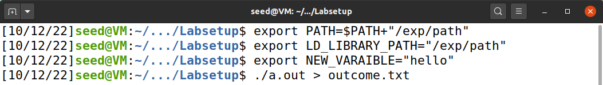
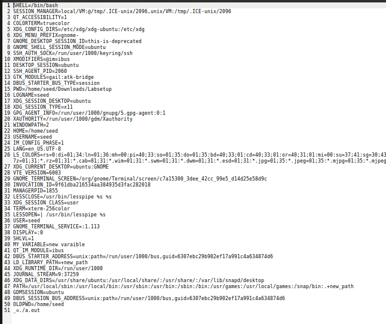

**Trabalho Realizado na Semana #4**

**2 Lab Tasks**

**2.1  Task 1: Manipulating Environment Variables**

- Using the command `printenv` we got the following environment variables:

- Using the command `env |grep PWD` we got this particular environment variables:

- Using the command `export`:

- Using the command `unset` we didn't get anything printed

**2.2 Task 2: Passing Environment Variables from Parent Process to Child Process**

After compiling and runing the program printenv.c, we saved the outup into a file named *file*

After commenting out the printenv() statement in the child process case, and uncommenting the printenv() statement in the parent process case, we got the following output

Then, we used `diff`to compare the two output files. 

Since we didn't get any output from this command we can conclude that the two files are the same, therefore the parent’s environment variables are inherited by the child process.

**2.3 Task 3: Environment Variables and execve()**

After running the program *myenv.c*, it didn't print out any environment variables, so the current process doesn't have any.

Then we change the invocation of `execve()`and now it printed environment variables.

In the first program, we are not preserving the old environment variables, because we are passing the object NULL.

In the second program, we pass`environ`which is a variable declared in`unistd.h`and it keeps track of the environment variables during the running of the current process.

**2.4 Task 4: Environment variables and system()**

After running the program *system.c* with the function call `system()`, with `/usr/bin/env"`as the only argument, the output showed all the environment variables.

This is because the `system()` function call uses `execl()` to execute */bin/sh; execl()*, calling `execve()` after that, passing to this new program all the environment variables, present on the output screen.

**2.5 Task 5: Environment Variable and Set-UID Programs**

We can see that all the environment variables we set using the command export in the parent shell process get into the Set-UID child process.

With this we can see that every  environment variable that is created in a process gets passed down to all of its children processes.

**2.6 Task 6: The PATH Environment Variable and Set-UID Programs**

Firstly we called the command `export PATH=/home/seed:$PATH` in order to add the directory home/seed to the PATH variable.
Then we compiled the program given as callLS, changing its permissions to root, in order to change it to a SET-UID program. We then created a program called ls.c that just printed "You just got hacked!" and moved it to the directory home/seed. We called the program callLS and verified that the output on the console showed "You just got hacked!", therefore proving that it is indeed possible to run malicious code from a poorly implemented Set-UID program.

# CTF Week 4

**Part One**

Firstly we browsed through the website in order to collect as much information as possible about it. We came to the conclusion that on the tab Recent Comments, there was a complaint about wordpress being hacked, as well as the revelation that the website didn't update their plugins, which gave us the sense that we needed to go deeper in this matter. 

We browsed through the additional information part of the website and discovered the different versions of Wordpress and plugins it used.

We found out on that there is a known exploit for the Booster for WooCommerce plugin (5.4.3), and therefore knew, this was the direction we needed to follow.

We submitted it in **Semana 4 - Desafio 1** and given the fact it was indeed the right flag, we knew we were on the right track.

**Part Two**

We began looking for an exploit for the vulnerability, and found it in Exploit DB

We downloaded the source code, compiled it and ran it against the server given getting as the output, three different links. We clicked them and found out that one of them led us to the website as the authenticated user "admin", therefore giving us access to the private post that contained the flag.

We submitted it in **Semana 4 - Desafio 2** and got once again, the right result.

