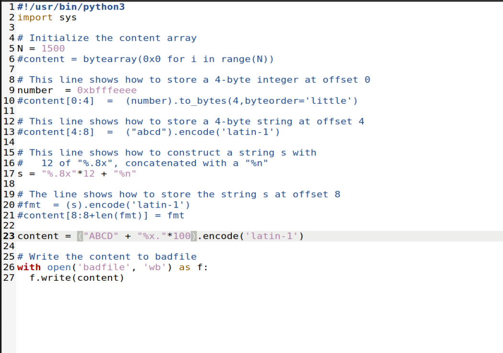

# **Trabalho Realizado na Semana #7**

**Lab Tasks**

**3 Task 1: Crashing the Program**

- For the first task, we need to provide an input, so that when the server program tries to print out the user input in the myprintf() function, it will crash. At first we just tried to connect with the server and send the string "hello".

- To crash the program we used an input with the symbol "%s". This causes the printf to try to get a string from the stack but because none was there, it crashed.

**4 Task 2: Printing Out the Server Program’s Memory**

***Task 2.A: Stack Data***

- The goal for this task is to print out some server data from its memory. This can be achieved by using an input string with "%x" that prints the address of memory in hexadecimal. To get the starting value of our input, we used trial and error until we got that. If we input 64 "%x" we get the address of our input.

***Task 2.B: Heap Data***

Now our task was to retrieve a secrete message that was somewhere on the heap. The address of this message was obtained from the server printout. To print this string on the console we first put the address of the string in the first 4 bytes of the input. This is beacause in the last task we knew the address that was needed to use to reach our input so we only had to put an %s pointing to that address and that allowed us to print the secret message.

**Task 3: Modifying the Server Program’s Memory**

***Task 3.A: Change the value to a different value***

The goal for this task was to change the value of the target variable. This can be achieved by using %n in the input which writes the number of characters written before the symbol to the value on the address, and using the same method that we used in the last task we could control the address that we wrote to.

***Task 3.B: Change the value to 0x5000***

In this task we used the same method as in the last. Because we had to write the value 0x5000 which is equivalent to 20480 in decimal and we can't write more than 1500 bytes in the file for the program to accept it, we had to use the %20476x specifier to fill in the bytes. The remaining 4 bytes were used to write the address of the value in the input.

# CTF 

**First Challenge**

On the first challenge we were presented with the following code:

We could tell right away that the vulnerability would be derived from the line `printf(buffer)`, which constitutes a bad code practice.

Still, we ran checksec, getting as a result:

We decided to dig deeper into the vulnerability, so, using exploit_example.py and gdb, we found out the address of the variable buffer, it being 0x804c060.

We now knew that, in order to get the flag, we needed to input \x60\xc0\x04\x08%s, for the program to output the value of the flag.

**Second Challenge** 

For the second challenge we were presented with the following code:

We figured out that in order for us to extract the flag, which was in the working directory, we would need to manipulate the variable key and overwrite it to 0xbeef

With gdb and the exploit script, we figured out that the address of the variable was: 0x804c034.

We needed to calculate the decimal value of 0xbeef for us to input it into the program

0xBEEF = 48879

But, since we already used 4 chars to write the address, we can only input 48879 - 4 = 48875.

Therefore, inputting the following code in the given script, we are directed to a terminal, it being the bash terminal on the directory:

We then can input `cat flag.txt` and receive the flag that we needed.
