**Trabalho Realizado na Semana #8**

**Lab Tasks**

**3.1 Task 1: Get Familiar with SQL Statements**

Para vermos todas as rows da table credential basta fazer-mos a query "select * from credential;" 
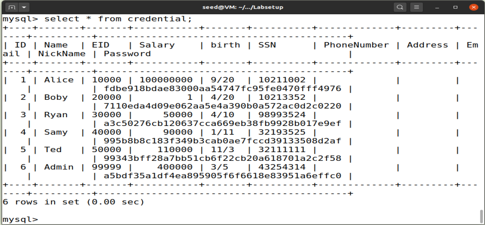
Para conseguirmos ver a row relativamente a user Alice faze-mos a query "select * from credential where Name = 'Alice';"
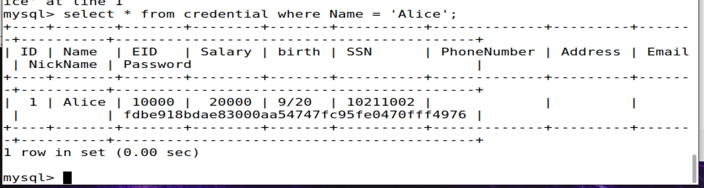

**3.2 Task 2: SQL Injection Attack on SELECT Statement**

***Task 2.1: SQL Injection Attack from webpage.***

Para entrar na conta de admim assumindo que sabemos que o username da conta é Admin, podemos simplesmente por no username a string "Admin'#" fazendo assim com que o query sql não verifique a password e nos de acesso a conta.
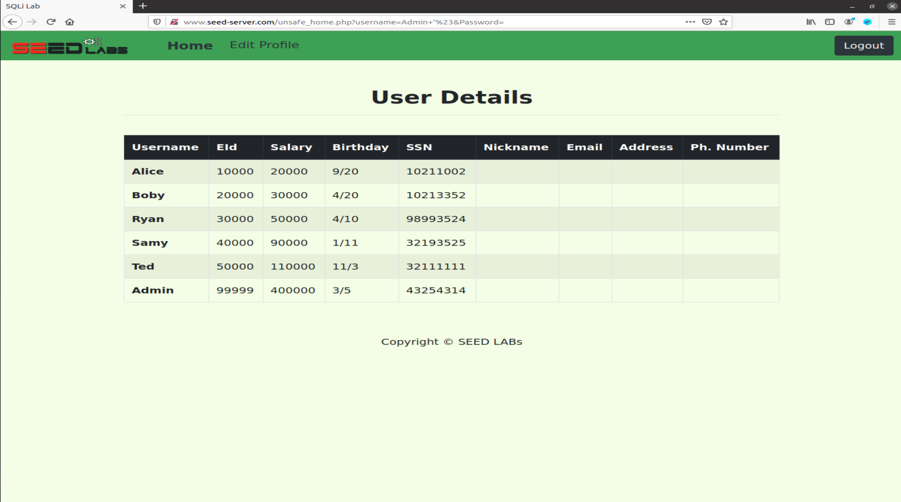

***Task 2.2: SQL Injection Attack from command line.***

Para entrar na conta de admin usando a linha de comandos podemos usar o comando curl com o seguinte url "http://www.seed-server.com/unsafe_home.php?username=Admin+%27%23&Password=", obtendo assim o mesmo resultado da task anterior mas sem usar o browser.
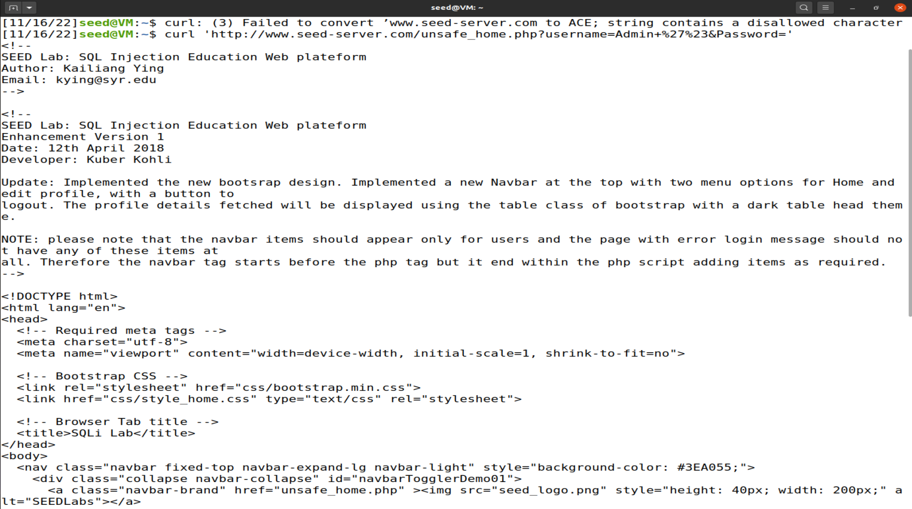

***Task 2.3: Append a new SQL statement***

Não podemos usar dois comandos sql porque o codigo "$conn -> query($sql);" só permite a execuçao de uma query sql.

**3.3 Task 3: SQL Injection Attack on UPDATE Statement**

***Task 3.1: Modify your own salary.***

Para entrar na conta da Alice podemos usar a mesma tecnica que para entrar na conta de admin com a string "Alice'#"
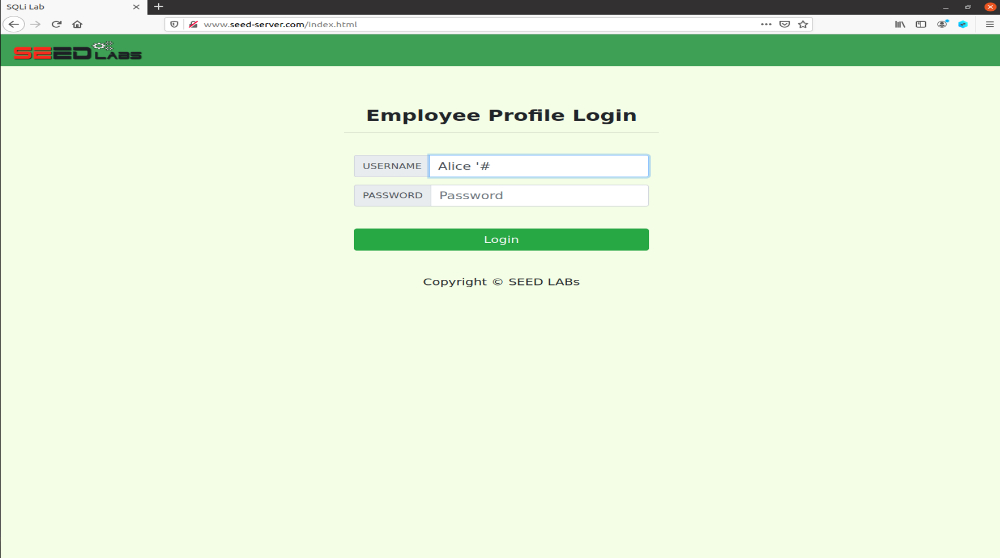

Para mudar o salario usamos o update query que se encontra na pagina de editar perfil, usando a string "',Salary = '100000000".
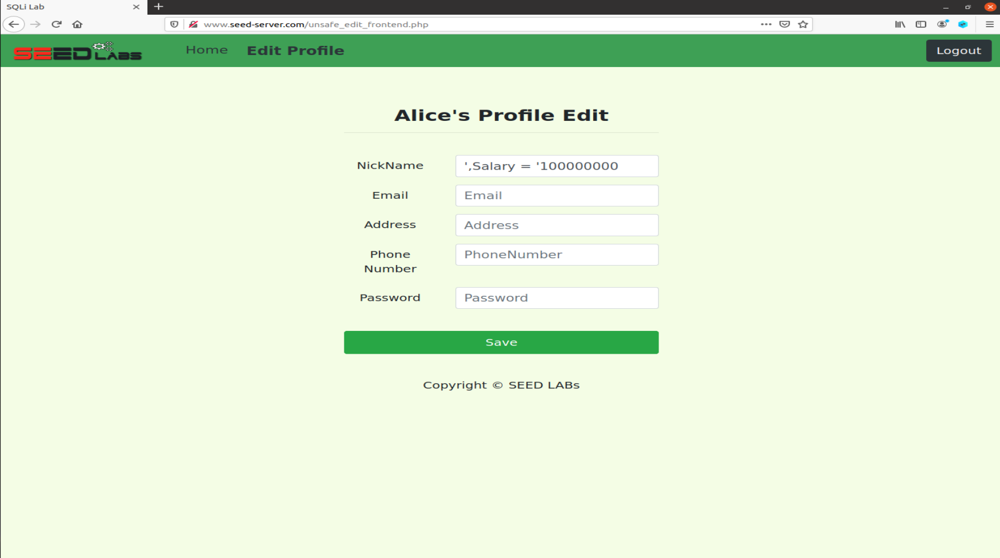

***Task 3.2: Modify other people’ salary.***

Para mudar o salario do Boby usamos a mesma tecnica mas adicionamos na query que row é que queremos modificar "',Salary = '1' where Name = 'Boby';#"
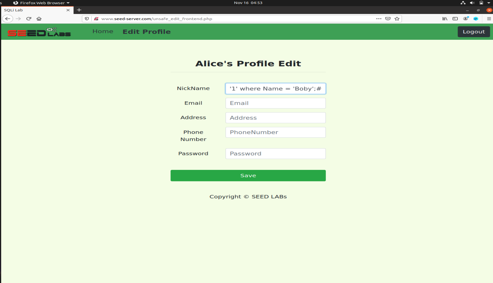

***Task 3.3: Modify other people’ password.***

Para mudar a palavra passe do boby primeiro precisamos de um valor hashed com a funcção sha1 o qual conhecemos o valor original
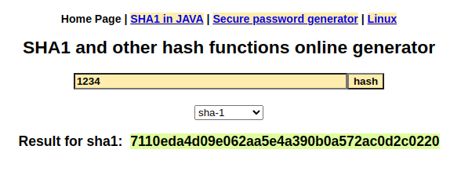
em seguida na parte de editar perfil da alice pomos a seguinte string "',Password = '7110eda4d09e062aa5e4a390b0a572ac0d2c0220' where Name = 'Boby';#" conseguindo assim mudar a palavra passe do boby par 1234.
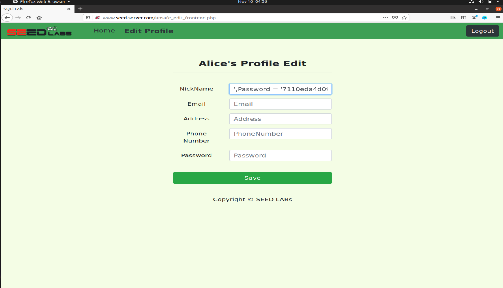
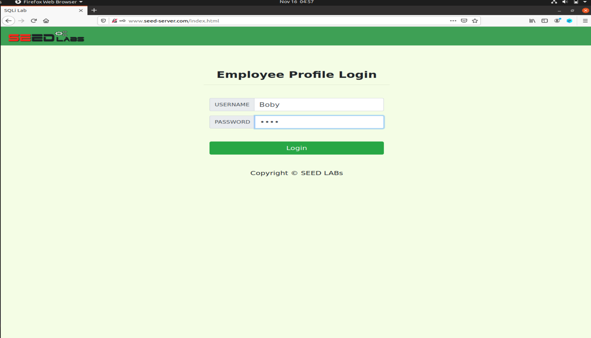
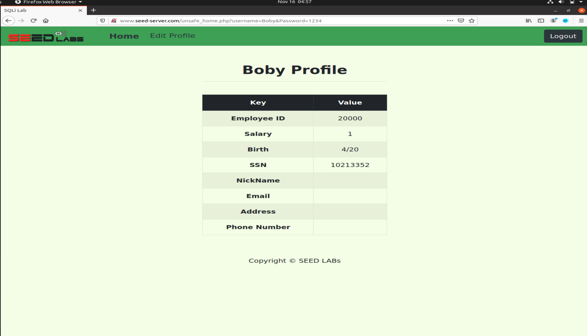

# CTF

**Semana 8 - Desafio 1**

We started by analysing the source code given to us in `index.php`

We noticed right away that the SELECT clause is not "safe", being vulnerable to SQLi, due to the inexistence of `prepare` or `execute` statements:

We, therefore, knew that for us to exploit the system and login as administrator, all we needed to do was submit as both the username and the password, an expression that would always return true, it being `' OR ''='`

We logged in and unlocked the flag

**Semana 8 - Desafio 2**

We started by analysing `main.c` and we noticed that the vulnerability would, most likely, be on `gets(buffer)` given that `gets()` is a widely-known unsafe function.

We then updated the exploit script given to us and used it to get the address of the buffer, by defining a function `getaddr()`

We decoded the address returned and proceded to get the bytes from it, using the function `bytearray.fromhex()`

We then reversed it, as that was what we needed to do in order for the future steps to work.

After that, using gdb, we found out that the offset we needed was exactly 108 bytes, and created a variable for it.
We also created a variable containing the desired shell code to call `/bin/sh`, that we found on shell-storm.

We finished by creating a variable `control` that puts all the aforementioned variables into one, that one being the sent to the server.

All that was left to do was run the python script and discover that the shell was indeed being called, making it easy for us to get the flag:

