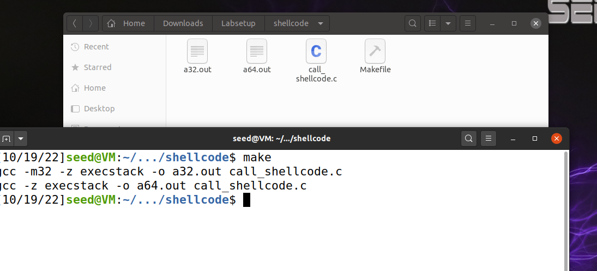
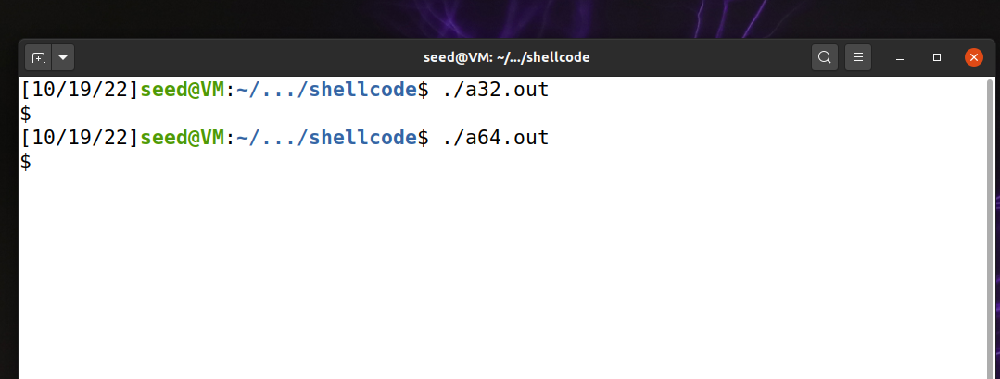
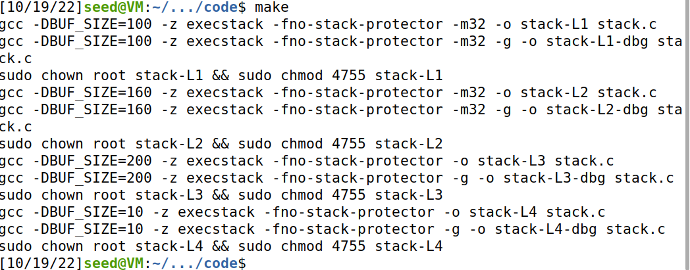
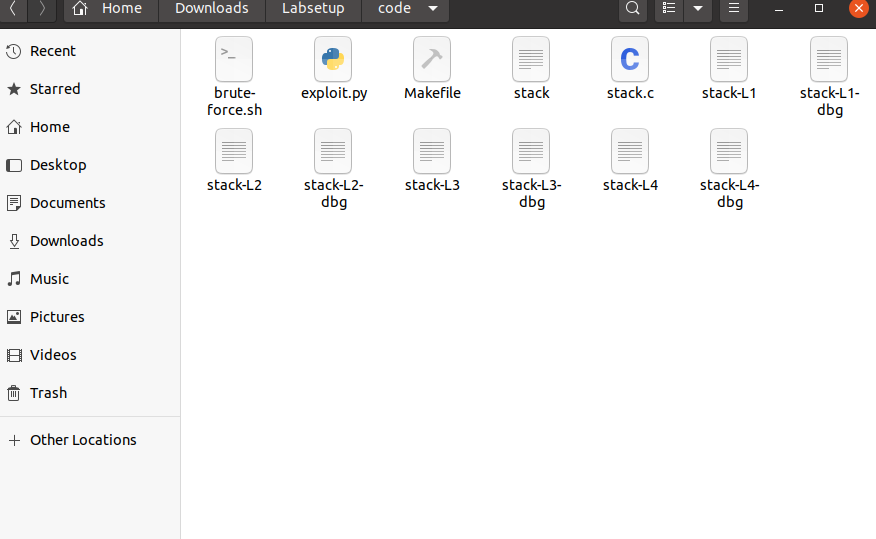
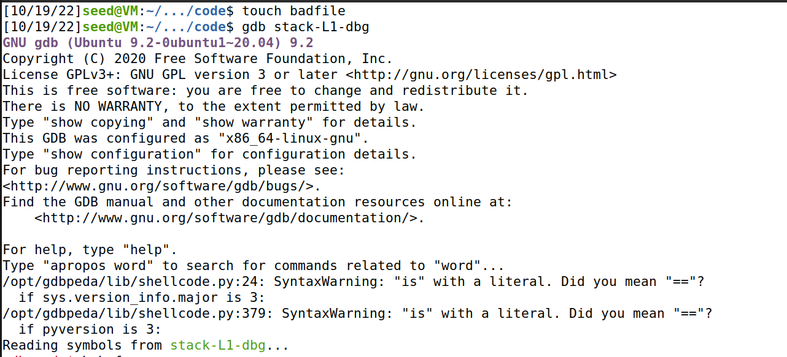
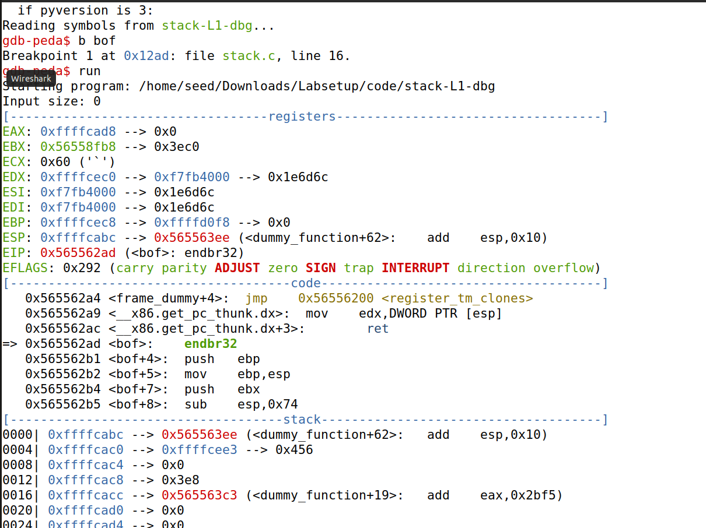
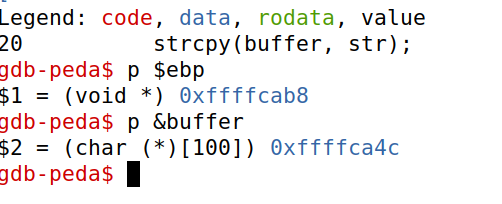
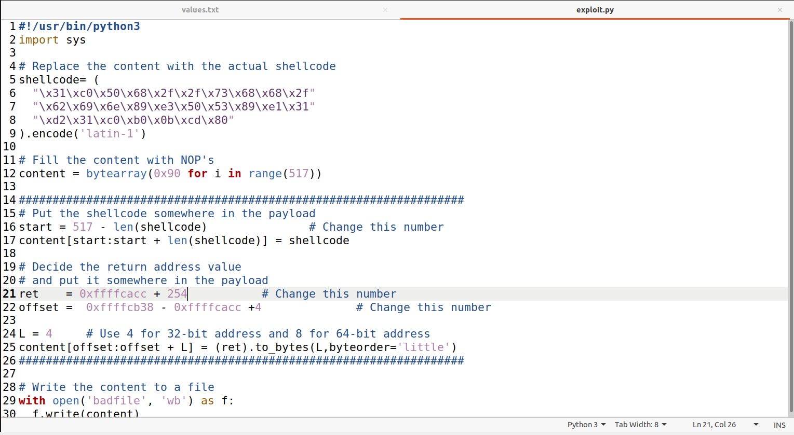
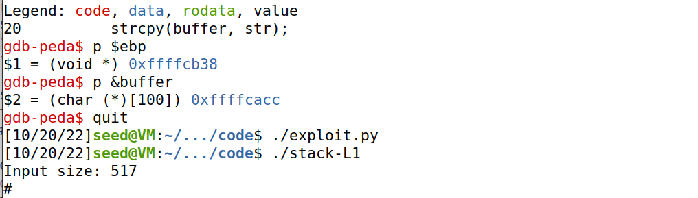

**Trabalho Realizado na Semana #5**

**CTF**

**Challenge 1**

The goal for this challenge was to understand the vulnerability found related to buffer overflow. Having that in mind we started by analysing the code.
First, we noticed that the file mem.txt was opened and read by the program.
Then, we tried to find a way to control which file is opened. To do that, we changed the name of the file that we want to open in the declaration of mem_file.
Lastly, we tried to understand if there was any buffer-overflow. We found out that there can occur a buffer-overflow since the buffer that allows the user to write allocates memory for 20 characters and the function scanf reads 28 characters. Those would be saved on the space used for the variable mem_file. Doing so, we alter the file from which we read and the flag needed is presented.

**Challenge 2**

For this challenge, we followed the same pattern as in the previous one.
First, we noticed that a variable val is used, the scanf function reads 32 characters instead of 28 and the file is only opened if it is equal to 0xfefc2122. Apart from that the code is similar to the one presented on the previous challenge. They don't fully mitigate the problem because it adds 4 characters that need to become different and there are only 4 characters to work with. It is possible to overcome mitigation using a technique similar to the one used before, since there is only the case of adding the val with the value equal to 0xfefc2122 in the middle of the sequence used before. In this case we used the string "01234567890123456789\x22\x21\xfc\xfeflag.txt" since the first 20 characters were not relevant for the exercise, the next 4 characters were the variable val with the correspondent value, but written in the opposite and the final part of the string is the name of the file we want to open and read.

**Lab Tasks**

**2  Task 1: Getting Familiar with Shellcode**

- Compiling the call_shellcode.c with the makefile we get the two executables a32.out and a64.out.

- After executing either of the executables we can see that the shellcode gets executed

**4 Task 2: Understanding the Vulnerable Program**

- After compiling the program using the makefile all of the executables are generated

**5 Task 3: Launching Attack on 32-bit Program (Level 1)**

- In this task first we used the debug mode to found the vaule of ebp and the adress of buffer

- After we have this values we need to build a script for constructing the badfile, we are using the script exploit.py that came with the files for these lab and the only thing we neede to do was change some values.

- First we had to fill the shellcode string with the shellcode given to us.
- Then we chose a place to put the shellcode inside the payload, to maximaze our chances of success we put the shellcode in the end of the file.
- After that we had to chosse the return addres to put in the payload With the values gathered before of %ebp and buffer we crafted an address that would point to one of the NOPs that takes us to the shellcode. So we decided to add 254 to the adress.
- The last step was chossing an offset, we calculated this by subtracting the &buffer to the $ebp value and added 4.

- Then we ran the exploit.py to create the badfile and next we ran the stack-L1 to execute the attack and we were granted access to the root shell.

